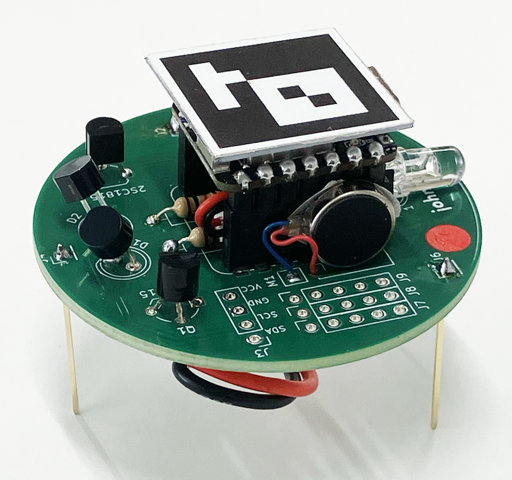

# johnbot2: Minimal Light-Mediated Swarm Robot Platform
_Swarm robot platform used in: “From Swarm to Individual: Emergent Individuality in Light-Mediated Robot Collectives” (2025)._

This repository contains the complete hardware and software implementation for **johnbot2**, the vibration-driven phototactic robot platform used in the study:

> **From Swarm to Individual: Emergent Individuality in Light-Mediated Robot Collectives**  
> Authors: johnsmith, Atsushi Masumori, Norihiro Maruyama, Takahide Yoshida, Takashi Ikegami  
> University of Tokyo / Alternative Machine Inc.  

---

## Overview

johnbot2 is a **5 cm circular PCB robot** driven by **two vibration motors**, equipped with:

- Two front-facing light sensors (90° FoV each)  
- A rear RGB LED (60° cone) for local visual signaling  
- An ESP8266/ESP32-based NodeMCU for control  
- Battery-powered, fully untethered operation  
- Additional - ArUco marker for overhead motion tracking

Robots demonstrate **phototaxis**, **light-mediated interactions**, and **emergent individuality** in a collective environment.

_(See Fig. 1 in the paper for an overview of the hardware layout  [oai_citation:1‡ikegami.pdf](sediment://file_00000000697c72088fa7500d9f754807))_

---

## Repository Structure
/hardware        # PCB (Gerber, KiCad), 3D models, BOM
/firmware        # ESP8266/ESP32 code implementing phototaxis controller
/software        # Optional host-side tools (tracking, OSC, analysis)
/docs            # Figures, diagrams, experimental setup references

## Hardware

- 5 cm diameter PCB  
- Two eccentric rotating mass (ERM) vibration motors for differential drive  
- Light sensors positioned symmetrically at the front  
- RGB LED for local signaling  
- NodeMCU ESP8266/ESP32 module  
- Battery: 3.7 V Li-ion  
- 3-legged support enabling vibration-driven locomotion

For fabrication details, see `hardware/README.md`.

_(Design summarized from Section 2.1 of the paper  [oai_citation:2‡ikegami.pdf](sediment://file_00000000697c72088fa7500d9f754807))_

---

## Firmware

Firmware implements the **sensor → motor mapping** formulas used in the paper:

- Sensor normalization  
- Sigmoid control mapping  
- Differential motor drive  
- Optional OSC/Wi-Fi communication

Details in `firmware/README.md`.

_(Mapping derived from Appendix A and Section 2.1  [oai_citation:3‡ikegami.pdf](sediment://file_00000000697c72088fa7500d9f754807))_

---

## Experiments & Reproduction

The original experiments used:

- Circular arena, 55 cm diameter  
- Ceiling-mounted tungsten light as global cue  
- Robot LED intensities: 0, 33, 66, 100%  
- Global illumination levels: 0, 25, 50, 75%  
- Overhead motion tracking with ArUco markers  
- 24 fps video  
- 15 min analysis window per trial  

(See Section 2.2–2.3 in the paper  [oai_citation:4‡ikegami.pdf](sediment://file_00000000697c72088fa7500d9f754807))

	•	Hardware: CERN-OHL-P-2.0 → see LICENSE_HARDWARE
	•	Software: MIT License → see LICENSE_SOFTWARE
